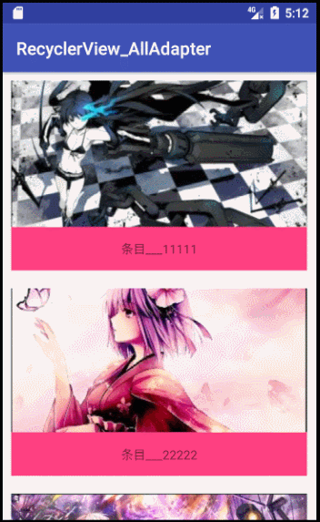

### RecycleView控件的使用(八) 为RecyclerView创建普遍适用的适配器，使得RecyclerView使用更加方便

效果图：



首先是MainActivity

```java
public class MainActivity extends AppCompatActivity {

    private RecyclerView mRecyclerView;
    AllCommonAdapter<MyBean> adapter;

    @Override
    protected void onCreate(Bundle savedInstanceState) {
        super.onCreate(savedInstanceState);
        setContentView(R.layout.activity_main);
        mRecyclerView = (RecyclerView) findViewById(R.id.mRecyclerView);
        List<MyBean> listData = new ArrayList();
        listData.add(new MyBean(R.mipmap.image01, "条目___11111"));
        listData.add(new MyBean(R.mipmap.image02, "条目___22222"));
        listData.add(new MyBean(R.mipmap.image03, "条目___33333"));
        listData.add(new MyBean(R.mipmap.image04, "条目___44444"));
        adapter = new AllCommonAdapter<MyBean>(this, R.layout.item_adapter_general, listData) {
            @Override
            public void convert(ViewHolder holder, MyBean myBean) {
                holder.setImageResource(R.id.imageView, myBean.getImageResID());
                holder.setText(R.id.textView_context, myBean.getContext());
            }
        };

        mRecyclerView.setLayoutManager(new GridLayoutManager(this, 1));
        mRecyclerView.setAdapter(adapter);
    }
}

```

#### 主要用到了两个类：AllCommonAdapter万能适配器和ViewHolder对象：

AllCommonAdapter类对象：

```java
public abstract class AllCommonAdapter<T> extends RecyclerView.Adapter<ViewHolder>
{
    protected Context mContext;
    protected int mLayoutId;
    protected List<T> mDatas;
    protected LayoutInflater mInflater;

    private OnItemClickListener mOnItemClickListener;

    public void setOnItemClickListener(OnItemClickListener onItemClickListener)
    {
        this.mOnItemClickListener = onItemClickListener;
    }

    public AllCommonAdapter(Context context, int layoutId, List<T> datas)
    {
        mContext = context;
        mInflater = LayoutInflater.from(context);
        mLayoutId = layoutId;
        mDatas = datas;
    }

    @Override
    public ViewHolder onCreateViewHolder(final ViewGroup parent, int viewType)
    {
        ViewHolder viewHolder = ViewHolder.get(mContext, null, parent, mLayoutId, -1);
        setListener(parent, viewHolder, viewType);
        return viewHolder;
    }

    protected int getPosition(RecyclerView.ViewHolder viewHolder)
    {
        return viewHolder.getAdapterPosition();
    }

    protected boolean isEnabled(int viewType)
    {
        return true;
    }


    protected void setListener(final ViewGroup parent, final ViewHolder viewHolder, int viewType)
    {
        if (!isEnabled(viewType)) return;
        viewHolder.getConvertView().setOnClickListener(new View.OnClickListener()
        {
            @Override
            public void onClick(View v)
            {
                if (mOnItemClickListener != null)
                {
                    int position = getPosition(viewHolder);
                    mOnItemClickListener.onItemClick(parent, v, mDatas.get(position), position);
                }
            }
        });


        viewHolder.getConvertView().setOnLongClickListener(new View.OnLongClickListener()
        {
            @Override
            public boolean onLongClick(View v)
            {
                if (mOnItemClickListener != null)
                {
                    int position = getPosition(viewHolder);
                    return mOnItemClickListener.onItemLongClick(parent, v, mDatas.get(position), position);
                }
                return false;
            }
        });
    }

    @Override
    public void onBindViewHolder(ViewHolder holder, int position)
    {
        holder.updatePosition(position);
        convert(holder, mDatas.get(position));
    }

    public abstract void convert(ViewHolder holder, T t);

    @Override
    public int getItemCount()
    {
        return mDatas.size();
    }

    public interface OnItemClickListener<T> {
        void onItemClick(ViewGroup parent, View view, T t, int position);
        boolean onItemLongClick(ViewGroup parent, View view, T t, int position);
    }
}
```

其中用到的ViewHolder类对象:

```java
public class ViewHolder extends RecyclerView.ViewHolder
{
    private SparseArray<View> mViews;
    private int mPosition;
    private View mConvertView;
    private Context mContext;
    private int mLayoutId;

    public ViewHolder(Context context, View itemView, ViewGroup parent, int position)
    {
        super(itemView);
        mContext = context;
        mConvertView = itemView;
        mPosition = position;
        mViews = new SparseArray<View>();
        mConvertView.setTag(this);

    }


    public static ViewHolder get(Context context, View convertView,
                                 ViewGroup parent, int layoutId, int position)
    {
        if (convertView == null)
        {
            View itemView = LayoutInflater.from(context).inflate(layoutId, parent,
                    false);
            ViewHolder holder = new ViewHolder(context, itemView, parent, position);
            holder.mLayoutId = layoutId;
            return holder;
        } else
        {
            ViewHolder holder = (ViewHolder) convertView.getTag();
            holder.mPosition = position;
            return holder;
        }
    }


    /**
     * 通过viewId获取控件
     *
     * @param viewId
     * @return
     */
    public <T extends View> T getView(int viewId)
    {
        View view = mViews.get(viewId);
        if (view == null)
        {
            view = mConvertView.findViewById(viewId);
            mViews.put(viewId, view);
        }
        return (T) view;
    }

    public View getConvertView()
    {
        return mConvertView;
    }

    /**
     * 设置TextView的值
     *
     * @param viewId
     * @param text
     * @return
     */
    public ViewHolder setText(int viewId, String text)
    {
        TextView tv = getView(viewId);
        tv.setText(text);
        return this;
    }

    public ViewHolder setImageResource(int viewId, int resId)
    {
        ImageView view = getView(viewId);
        view.setImageResource(resId);
        return this;
    }

    public ViewHolder setImageBitmap(int viewId, Bitmap bitmap)
    {
        ImageView view = getView(viewId);
        view.setImageBitmap(bitmap);
        return this;
    }

    public ViewHolder setImageDrawable(int viewId, Drawable drawable)
    {
        ImageView view = getView(viewId);
        view.setImageDrawable(drawable);
        return this;
    }

    public ViewHolder setBackgroundColor(int viewId, int color)
    {
        View view = getView(viewId);
        view.setBackgroundColor(color);
        return this;
    }

    public ViewHolder setBackgroundRes(int viewId, int backgroundRes)
    {
        View view = getView(viewId);
        view.setBackgroundResource(backgroundRes);
        return this;
    }

    public ViewHolder setTextColor(int viewId, int textColor)
    {
        TextView view = getView(viewId);
        view.setTextColor(textColor);
        return this;
    }

    public ViewHolder setTextColorRes(int viewId, int textColorRes)
    {
        TextView view = getView(viewId);
        view.setTextColor(mContext.getResources().getColor(textColorRes));
        return this;
    }

    @SuppressLint("NewApi")
    public ViewHolder setAlpha(int viewId, float value)
    {
        if (Build.VERSION.SDK_INT >= Build.VERSION_CODES.HONEYCOMB)
        {
            getView(viewId).setAlpha(value);
        } else
        {
            // Pre-honeycomb hack to set Alpha value
            AlphaAnimation alpha = new AlphaAnimation(value, value);
            alpha.setDuration(0);
            alpha.setFillAfter(true);
            getView(viewId).startAnimation(alpha);
        }
        return this;
    }

    public ViewHolder setVisible(int viewId, boolean visible)
    {
        View view = getView(viewId);
        view.setVisibility(visible ? View.VISIBLE : View.GONE);
        return this;
    }

    public ViewHolder linkify(int viewId)
    {
        TextView view = getView(viewId);
        Linkify.addLinks(view, Linkify.ALL);
        return this;
    }

    public ViewHolder setTypeface(Typeface typeface, int... viewIds)
    {
        for (int viewId : viewIds)
        {
            TextView view = getView(viewId);
            view.setTypeface(typeface);
            view.setPaintFlags(view.getPaintFlags() | Paint.SUBPIXEL_TEXT_FLAG);
        }
        return this;
    }

    public ViewHolder setProgress(int viewId, int progress)
    {
        ProgressBar view = getView(viewId);
        view.setProgress(progress);
        return this;
    }

    public ViewHolder setProgress(int viewId, int progress, int max)
    {
        ProgressBar view = getView(viewId);
        view.setMax(max);
        view.setProgress(progress);
        return this;
    }

    public ViewHolder setMax(int viewId, int max)
    {
        ProgressBar view = getView(viewId);
        view.setMax(max);
        return this;
    }

    public ViewHolder setRating(int viewId, float rating)
    {
        RatingBar view = getView(viewId);
        view.setRating(rating);
        return this;
    }

    public ViewHolder setRating(int viewId, float rating, int max)
    {
        RatingBar view = getView(viewId);
        view.setMax(max);
        view.setRating(rating);
        return this;
    }

    public ViewHolder setTag(int viewId, Object tag)
    {
        View view = getView(viewId);
        view.setTag(tag);
        return this;
    }

    public ViewHolder setTag(int viewId, int key, Object tag)
    {
        View view = getView(viewId);
        view.setTag(key, tag);
        return this;
    }

    public ViewHolder setChecked(int viewId, boolean checked)
    {
        Checkable view = (Checkable) getView(viewId);
        view.setChecked(checked);
        return this;
    }

    /**
     * 关于事件的
     */
    public ViewHolder setOnClickListener(int viewId,
                                         View.OnClickListener listener)
    {
        View view = getView(viewId);
        view.setOnClickListener(listener);
        return this;
    }

    public ViewHolder setOnTouchListener(int viewId,
                                         View.OnTouchListener listener)
    {
        View view = getView(viewId);
        view.setOnTouchListener(listener);
        return this;
    }

    public ViewHolder setOnLongClickListener(int viewId,
                                             View.OnLongClickListener listener)
    {
        View view = getView(viewId);
        view.setOnLongClickListener(listener);
        return this;
    }

    public void updatePosition(int position)
    {
        mPosition = position;
    }

    public int getLayoutId()
    {
        return mLayoutId;
    }
}
```